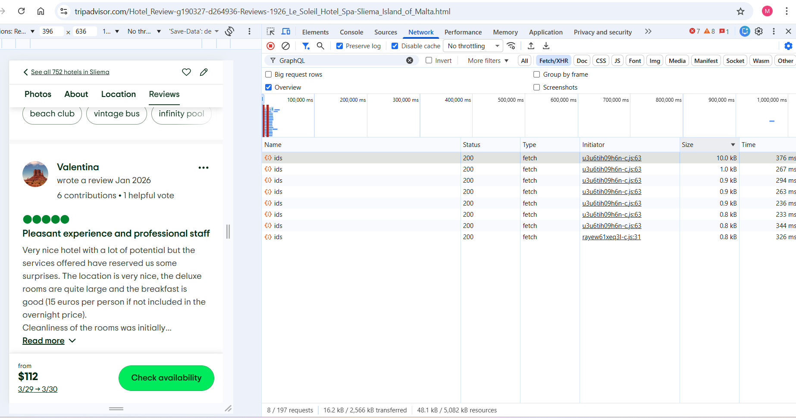
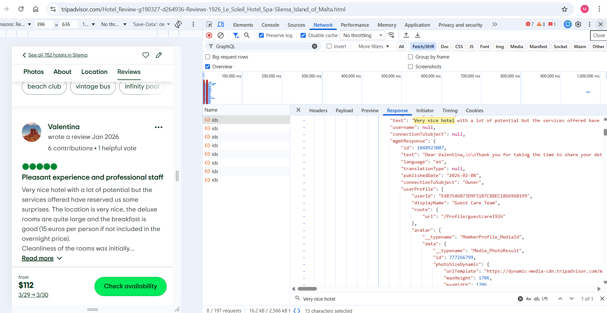
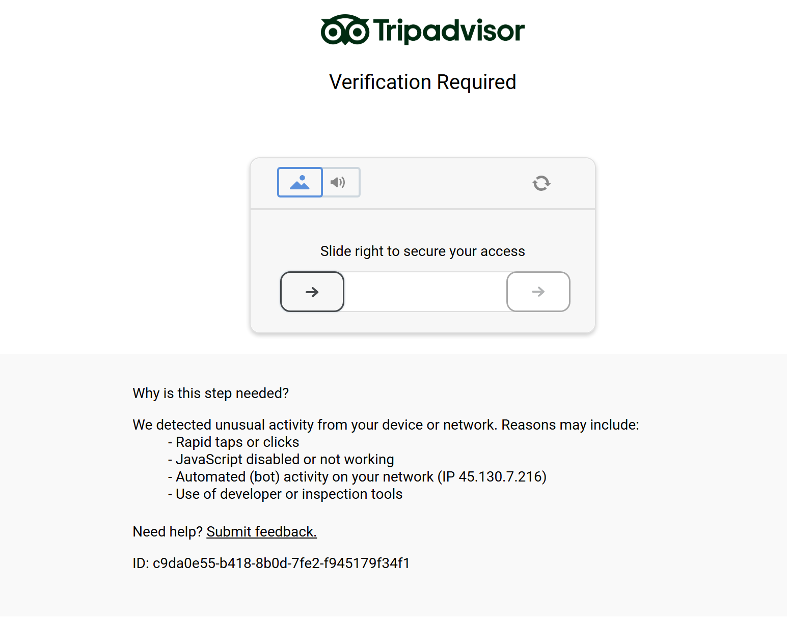
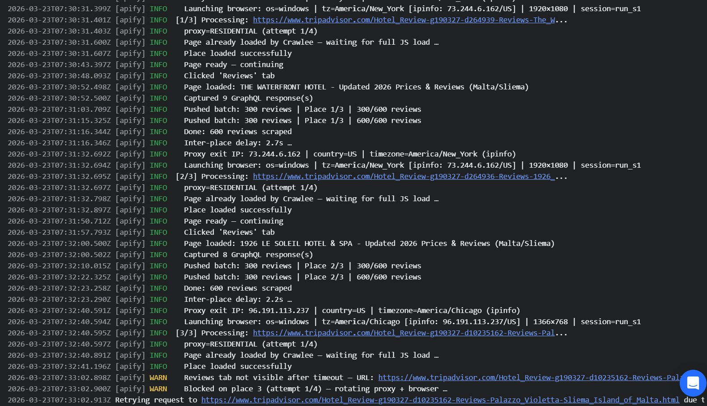
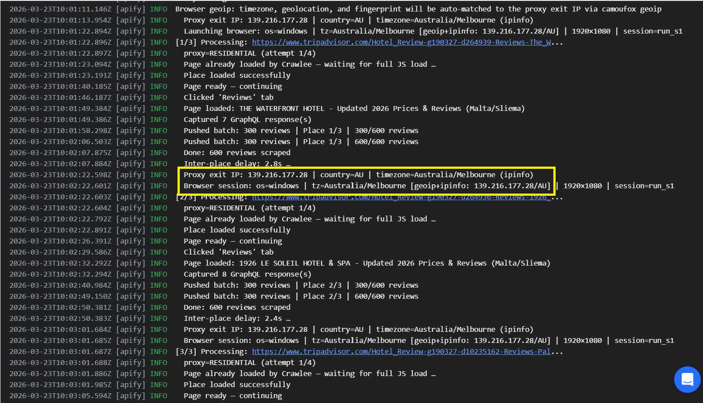
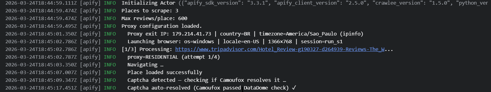

:::note
One of our community members wrote this guide as a contribution to the Crawlee Blog. If you'd like to contribute articles like these, please reach out to us on [Apify's Discord channel](https://discord.com/invite/jyEM2PRvMU).
:::

I built this Actor for the [Apify Store](https://apify.com/store) to give developers reliable, structured access to TripAdvisor review data at scale. TripAdvisor is protected by [DataDome](https://datadome.co/), one of the more aggressive bot protection systems, and scraping it consistently required some non-obvious solutions — a GraphQL API discovered through DevTools, a stealth Firefox fork instead of Chromium, and a few counterintuitive proxy decisions.

TripAdvisor review data is useful for a wide range of real-world applications:

- **Reputation management** — monitor ratings and review volume over time for your own properties
- **Competitor monitoring and intelligence** — track competitors' review trends, response rates, and sentiment shifts
- **Sentiment analysis and insights** — process structured review text for NLP pipelines
- **Trend spotting** — detect emerging topics (service issues, location problems, staff mentions) before they affect ratings
- **AI/LLM training data** — large-scale authentic review text in multiple languages
- **Market research** — aggregate data across property categories, cities, or price tiers

After hitting walls with standard headless Chromium approaches, I ended up with a solution built around Crawlee, a custom [Camoufox](https://camoufox.com/) browser plugin, and TripAdvisor's internal [GraphQL](https://graphql.org) API. This article walks through exactly what I built, what broke, and the specific lessons I wouldn't have learned without going through the whole process.

## What the Actor does

An Apify Actor that accepts one or more TripAdvisor place URLs (hotels, restaurants, attractions) and produces two outputs:

- **Places dataset** — metadata: name, rating, address, total review count, price range, image URL
- **Reviews dataset** — individual reviews: title, text, rating, date, traveler type, reviewer name, helpful votes, management response

The Actor uses Crawlee's [`PlaywrightCrawler`](https://crawlee.dev/python/docs/guides/playwright-crawler) with a custom `CamoufoxPlugin` to launch Camoufox (a fingerprint-evasion Firefox fork) instead of standard Playwright browsers. Reviews are fetched directly from TripAdvisor's internal GraphQL API using 50 parallel `asyncio.gather()` calls per pagination batch — fast, structured, and not dependent on DOM layout.

:::note
If you find this article useful, consider starring [Crawlee for Python on GitHub](https://github.com/apify/crawlee-python). It helps spread the word to other scraper developers.
:::

## Step 1: Inspect TripAdvisor with DevTools before writing any code

Before touching a keyboard, I spent 20 minutes in DevTools on a TripAdvisor hotel page. This was the most valuable 20 minutes of the whole project.

Here's exactly what to do:

1. Open a TripAdvisor place page — for example: `https://www.tripadvisor.com/Hotel_Review-g190327-d264939-Reviews-The_Waterfront_Hotel-Sliema_Island_of_Malta.html`
2. Open DevTools (F12) → **Network** tab → select **Fetch/XHR**
3. Type `graphql` in the filter box — this shows only calls to `https://www.tripadvisor.com/data/graphql/ids`
4. Check **Preserve log** and **Disable cache**
5. Scroll down to the reviews section on the page
6. Click the **Size** column to sort descending — the reviews response is usually the largest



Click any large request. In the **Response** tab you'll see review text matching what's on screen — "Very nice hotel…" — confirming this is the right endpoint.



Right-click the request → **Copy → Copy as cURL**. This gives you the full URL, all headers, and the exact JSON payload in one shot.

## Step 2: Understand the GraphQL payload, response, and headers

### Payload

TripAdvisor uses a `preRegisteredQueryId` pattern — one endpoint that handles multiple operation types based on an opaque ID. After inspecting several requests, the one that returns reviews is:

**Query ID:** `ef1a9f94012220d3`

:::note
There are several query IDs on this endpoint. `ef1a9f94012220d3` is the reviews query. `3f2df7139a71a643` returns page routing data. Others return Q&A, photos, etc. Using the wrong ID is a common mistake that wastes a lot of debugging time.
:::

The payload captured from DevTools:

```json
[
  {
    "variables": {
      "locationId": 264936,
      "filters": [
        { "axis": "LANGUAGE", "selections": ["en"] }
      ],
      "limit": 10,
      "offset": 10,
      "sortType": null,
      "sortBy": "SERVER_DETERMINED",
      "language": "en",
      "doMachineTranslation": true,
      "photosPerReviewLimit": 3
    },
    "extensions": {
      "preRegisteredQueryId": "ef1a9f94012220d3"
    }
  }
]
```

Key fields:
- `locationId` — the numeric place ID extracted from the URL (e.g. `d264936` → `264936`)
- `limit: 10` — always 10 reviews per request
- `offset` — pagination cursor (0, 10, 20, …)
- `sortBy: "SERVER_DETERMINED"` — TripAdvisor's default sort order

The Python function that builds this payload:

```python
async def fetch_reviews_via_graphql(
    page: Page, location_id: str, offset: int = 0, limit: int = 10
) -> Optional[list]:
    """
    Fetch full hotel reviews via ReviewsProxy_getReviewListPageForLocation.
    Query ef1a9f94012220d3 (from devtools/cURL.txt).
    """
    variables = {
        "locationId": int(location_id),
        "filters": [{"axis": "LANGUAGE", "selections": ["en"]}],
        "limit": limit,
        "offset": offset,
        "sortType": None,
        "sortBy": "SERVER_DETERMINED",
        "language": "en",
        "doMachineTranslation": True,
        "photosPerReviewLimit": 3,
    }
    payload = [
        {"variables": variables, "extensions": {"preRegisteredQueryId": REVIEWS_QUERY_ID}}
    ]
```

### Response structure

The response key we want is `ReviewsProxy_getReviewListPageForLocation`:

- **Response key:** `ReviewsProxy_getReviewListPageForLocation` (not `CommunityUGC__locationTips` or Q&A keys)
- **Structure:** `data.ReviewsProxy_getReviewListPageForLocation[0]` → `reviews[]`, `totalCount`
- **Review fields:** `id`, `title`, `text`, `rating`, `publishedDate`, `userProfile.displayName`, `tripInfo.tripType`, `helpfulVotes`, `mgmtResponse.text` (can be `null`)

A truncated sample of the raw GraphQL response (from `response.json`):

```json
[
  {
    "data": {
      "ReviewsProxy_getReviewListPageForLocation": [
        {
          "totalCount": 1004,
          "reviews": [
            {
              "id": 1044599990,
              "status": "PUBLISHED",
              "createdDate": "2026-01-02",
              "publishedDate": "2026-01-08",
              "userProfile": {
                "displayName": "Valentina",
                "username": "Valentinamatisse"
              },
              "rating": 5,
              "title": "Pleasant experience and professional staff",
              "language": "en",
              "text": "Very nice hotel with a lot of potential...",
              "helpfulVotes": 0,
              "mgmtResponse": {
                "text": "Dear Valentina, Thank you for taking the time...",
                "publishedDate": "2026-02-08",
                "connectionToSubject": "Owner"
              }
            }
          ]
        }
      ]
    }
  }
]
```

The response parsing handles multiple possible sub-key shapes — TripAdvisor occasionally changes which key the review list appears under:

```python
# ReviewsProxy_getReviewListPageForLocation (from devtools/Response.txt)
reviews_proxy = inner.get("ReviewsProxy_getReviewListPageForLocation")
if isinstance(reviews_proxy, list) and reviews_proxy:
    first = reviews_proxy[0]
    if isinstance(first, dict):
        reviews_data = first.get("reviews")
    else:
        reviews_data = None
else:
    reviews_data = None
if reviews_data is not None:
    if isinstance(reviews_data, dict):
        reviews_list = (
            reviews_data.get("reviews")
            or reviews_data.get("reviewList")
            or reviews_data.get("socialObjects")
            or []
        )
    else:
        reviews_list = reviews_data if isinstance(reviews_data, list) else []
```

### cURL command and endpoint

Right-clicking the request and choosing **Copy → Copy as cURL** gives the full picture — endpoint, all headers, and payload in one command. The key details confirmed:

```bash
curl 'https://www.tripadvisor.com/data/graphql/ids' \
  -H 'accept: */*' \
  -H 'accept-language: en-US,en;q=0.9' \
  -H 'cache-control: no-cache' \
  -H 'content-type: application/json' \
  -H 'origin: https://www.tripadvisor.com' \
  -H 'pragma: no-cache' \
  -H 'referer: https://www.tripadvisor.com/Hotel_Review-g190327-d264936-Reviews-1926_Le_Soleil_Hotel_Spa-Sliema_Island_of_Malta.html' \
  --data-raw '[{"variables":{...},"extensions":{"preRegisteredQueryId":"ef1a9f94012220d3"}}]'
```

In the Actor, we replicate this from within the browser using `page.evaluate()`. The Python call wrapping the JavaScript `fetch()`:

```python
url = "https://www.tripadvisor.com/data/graphql/ids"
result = await page.evaluate(
    """
    async (args) => {
        const resp = await fetch(args.url, {
            method: 'POST',
            credentials: 'include',
            headers: {
                'Content-Type': 'application/json',
                'Accept': '*/*',
                'Origin': 'https://www.tripadvisor.com',
                'Referer': window.location.href,
            },
            body: JSON.stringify(args.payload),
        });
        if (!resp.ok) return null;
        return await resp.json();
    }
    """,
    {"url": url, "payload": payload},
)
```

### Request headers

The required headers captured from DevTools (`headers.txt`):

```
:authority: www.tripadvisor.com
:method: POST
:path: /data/graphql/ids
content-type: application/json
origin: https://www.tripadvisor.com
referer: https://www.tripadvisor.com/Hotel_Review-g190327-d264936-Reviews-1926_Le_Soleil_Hotel_Spa-Sliema_Island_of_Malta.html
```

In the `page.evaluate()` call, `credentials: 'include'` ensures the browser's session cookies are sent automatically, and `Referer: window.location.href` mirrors the current page URL — matching what the DevTools headers show:

```python
result = await page.evaluate(
    """
    async (args) => {
        const resp = await fetch(args.url, {
            method: 'POST',
            credentials: 'include',
            headers: {
                'Content-Type': 'application/json',
                'Accept': '*/*',
                'Origin': 'https://www.tripadvisor.com',
                'Referer': window.location.href,
            },
            body: JSON.stringify(args.payload),
        });
        if (!resp.ok) return null;
        return await resp.json();
    }
    """,
    {"url": url, "payload": payload},
)
```

## Step 3: Fetch reviews from within the browser using `page.evaluate()`

This is the core technique. TripAdvisor's GraphQL API validates session cookies and CSRF state, so calling it directly from Python with `httpx` or `requests` doesn't work reliably. Instead, I run a `fetch()` call from inside the Playwright page using `page.evaluate()`. This inherits all the browser's cookies — including any DataDome approval cookies — with no manual authentication needed.

```python
result = await page.evaluate(
    """
    async (args) => {
        const resp = await fetch(args.url, {
            method: 'POST',
            credentials: 'include',
            headers: {
                'Content-Type': 'application/json',
                'Accept': '*/*',
                'Origin': 'https://www.tripadvisor.com',
                'Referer': window.location.href,
            },
            body: JSON.stringify(args.payload),
        });
        if (!resp.ok) return null;
        return await resp.json();
    }
    """,
    {"url": url, "payload": payload},
)
```

The request runs in JavaScript inside the browser context. Clean, structured JSON comes back directly. This pattern works for any site where the API relies on session cookies that are difficult to replicate externally.

## Step 4: Parallel GraphQL pagination

Each request returns exactly 10 reviews. To scrape 500 reviews efficiently, I run batches of 50 concurrent requests using `asyncio.gather()`:

```python
PARALLEL_REQUESTS = 50
reviews_per_page = 10
reviews_offset = 0

while True:
    # Offsets for this batch: 0, 10, 20, …, 490 when PARALLEL_REQUESTS == 50
    batch_offsets = [
        reviews_offset + i * reviews_per_page
        for i in range(PARALLEL_REQUESTS)
    ]
    if max_reviews:
        batch_offsets = [o for o in batch_offsets if o < max_reviews]
    if not batch_offsets:
        break

    # One async coroutine per offset (each calls page.evaluate → fetch in the browser)
    tasks = [
        fetch_reviews_via_graphql(
            page, loc_id, offset=o, limit=reviews_per_page,
            rating_filters=rating_filters,
            language_filter=language_filter,
        )
        for o in batch_offsets
    ]

    # Run all tasks concurrently
    batch_results = await asyncio.gather(*tasks, return_exceptions=True)

    if not got_any or got_partial:
        break
    reviews_offset += PARALLEL_REQUESTS * reviews_per_page
    await asyncio.sleep(random.uniform(0.8, 1.5))
```

I tested 40, 50, 60, and 100 parallel requests. Beyond 50, runtime didn't improve and blocking probability increased. 50 is the practical sweet spot for this endpoint.

The advantages of this approach over HTML parsing:
- **Clean data** — JSON is structured; avoids fragile CSS selectors
- **Performance** — 50 concurrent requests vs. scrolling and parsing DOM one page at a time
- **Stability** — TripAdvisor can rearrange HTML without affecting the API contract
- **Scale** — no hard cap from HTML pagination; can reach thousands of reviews per place

## Output

After a successful run, the Actor produces two datasets.

**Places** (Key-Value Store, `places.json`):

```json
[
  {
    "id": "264939",
    "url": "https://www.tripadvisor.com/Hotel_Review-g190327-d264939-Reviews-The_Waterfront_Hotel-Sliema_Island_of_Malta.html",
    "name": "The Waterfront Hotel",
    "place_type": "LodgingBusiness",
    "rating": "4.4",
    "totalReviews": 3876,
    "scrapedReviews": 600,
    "address": "Triq Ix - Xatt",
    "city": "Sliema",
    "region": "",
    "country": "MT",
    "price_range": "$ (Based on Average Nightly Rates for a Standard Room from our Partners)",
    "image": "https://dynamic-media-cdn.tripadvisor.com/media/photo-o/2a/52/68/5d/the-waterfront-hotel.jpg?w=500&h=-1&s=1",
    "ratingDistribution": null,
    "oldestDate": "2025-08-17",
    "error": null
  }
]
```

**Reviews** (Dataset):

```json
[
  {
    "placeName": "The Waterfront Hotel",
    "rating": 5,
    "title": "Enjoyable 4 night stay at the Waterfront hotel Sliema, Malta",
    "text": "The hotel was fairly modern and our room was very clean and the king size bed was comfortable. The staff were very helpful and friendly, the breakfasts were very good with lots of options from yogurts to omelettes.",
    "publishedDate": "2026-03-24",
    "travelDate": "2026-03",
    "tripType": "NONE",
    "lang": "en",
    "reviewerName": "Stephen O",
    "helpfulVotes": 0,
    "placeUrl": "https://www.tripadvisor.com/Hotel_Review-g190327-d264939-Reviews-The_Waterfront_Hotel-Sliema_Island_of_Malta.html"
  }
]
```

## Step 5: Hitting DataDome — and switching to Camoufox

My first implementation used standard Playwright with Chromium and Patchright (a stealth-patched Chromium fork). On the first local run, I got this:



DataDome detected the headless Chromium fingerprint. I could solve it locally with a quick slider automation:

```python
# Find slider, drag to the right
slider = page.locator('[data-testid="slider"]')
box = await slider.bounding_box()
await page.mouse.move(box['x'], box['y'] + box['height'] / 2)
await page.mouse.down()
await page.mouse.move(box['x'] + 300, box['y'] + box['height'] / 2, steps=20)
await page.mouse.up()
```

But that doesn't scale to Apify Cloud. Even with every stealth patch applied, headless Chromium consistently failed DataDome's fingerprint checks.

[Camoufox](https://camoufox.com/) is a Firefox fork built specifically for fingerprint evasion. Unlike stealth patches applied on top of Chromium, it modifies Firefox at the binary level. It spoofs:

- WebGL vendor and renderer
- Canvas fingerprint
- AudioContext
- Fonts
- Timezone and locale
- Navigator properties (platform, plugins, hardware concurrency)

The basic Camoufox setup:

```python
from playwright.async_api import async_playwright
from camoufox import AsyncNewBrowser

async def run():
    async with async_playwright() as pw:
        browser = await AsyncNewBrowser(
            pw,
            headless=True,          # False locally; True on Apify Cloud
            os="windows",
            block_webrtc=True,
            locale="en-US",
        )
        context = await browser.new_context(viewport={"width": 1920, "height": 1080})
        page = await context.new_page()
        await page.goto("https://example.com", wait_until="domcontentloaded")
        # … scrape …
        await context.close()
        await browser.close()
```

After switching to Camoufox with a residential proxy, the captcha stopped appearing on most requests. When it did appear, Camoufox's fingerprint was convincing enough that DataDome cleared it automatically within a few seconds.

## Step 6: Integrating Camoufox into Crawlee

Crawlee's `PlaywrightCrawler` uses a `BrowserPool` to manage browser lifecycle. Crawlee has a guide on [avoiding getting blocked](https://crawlee.dev/python/docs/guides/avoid-blocking) that covers fingerprinting, headers, and proxy use — but for DataDome specifically, I needed to go further and replace the browser entirely. To use Camoufox instead of standard Playwright browsers, I subclassed `PlaywrightBrowserPlugin` and overrode `new_browser()`:

```python
from crawlee.browsers import BrowserPool, PlaywrightBrowserController, PlaywrightBrowserPlugin
from camoufox import AsyncNewBrowser
from typing_extensions import override

class CamoufoxPlugin(PlaywrightBrowserPlugin):
    """
    Crawlee BrowserPlugin that launches Camoufox (stealth Firefox) instead of
    standard Playwright Firefox. All other PlaywrightBrowserPlugin behaviour
    (context creation, proxy injection, page lifecycle) is inherited unchanged.
    """

    def __init__(self, *, browser_state: dict, proxy_url_getter=None, **kwargs):
        super().__init__(**kwargs)
        self._browser_state = browser_state
        self._proxy_url_getter = proxy_url_getter

    @override
    async def new_browser(self) -> PlaywrightBrowserController:
        vp = random.choice(VIEWPORTS)
        is_headless = os.environ.get("APIFY_IS_AT_HOME") == "1"

        launch_options = {
            "os": "windows",
            "block_webrtc": True,
            "locale": "en-US",
            "headless": is_headless,
        }

        proxy_url = await self._proxy_url_getter() if self._proxy_url_getter else None
        if proxy_url:
            try:
                launch_options["proxy"] = _apify_proxy_url_to_playwright_proxy(proxy_url)
                launch_options["geoip"] = True
                browser = await AsyncNewBrowser(self._playwright, **launch_options)
            except (NotInstalledGeoIPExtra, InvalidIP, InvalidProxy):
                launch_options.pop("geoip", None)
                launch_options.pop("proxy", None)
                browser = await AsyncNewBrowser(self._playwright, **launch_options)
        else:
            browser = await AsyncNewBrowser(self._playwright, **launch_options)

        return PlaywrightBrowserController(
            browser=browser,
            header_generator=None,  # Camoufox generates its own headers
        )
```

The `PlaywrightCrawler` setup:

```python
browser_pool = BrowserPool(
    plugins=[CamoufoxPlugin(
        browser_state=browser_state,
        proxy_url_getter=_proxy_url_for_geoip,
    )],
    browser_inactive_threshold=timedelta(minutes=30),
    identify_inactive_browsers_interval=timedelta(minutes=30),
)

crawler = PlaywrightCrawler(
    browser_pool=browser_pool,
    proxy_configuration=crawlee_proxy_config,
    max_request_retries=max_retries,
    concurrency_settings=ConcurrencySettings(max_concurrency=1, desired_concurrency=1),
    retry_on_blocked=False,
    ignore_http_error_status_codes=[403, 429, 503],
    request_handler_timeout=timedelta(seconds=1200),
    navigation_timeout=timedelta(seconds=120),
)
```

Key settings:
- `max_concurrency=1` — one place at a time; one browser reused for all places (crucial for DataDome cookie accumulation — see anti-blocking section below)
- `retry_on_blocked=False` — we handle DataDome blocks ourselves via `CaptchaBlockedError`
- `ignore_http_error_status_codes=[403, 429, 503]` — let Camoufox handle these instead of Crawlee aborting immediately

## Performance optimizations

After I had the basic version working, I profiled it and found 22–66 seconds of unnecessary waiting per place. Here's what I changed and why.

### `domcontentloaded` instead of `networkidle`

TripAdvisor loads analytics and ad scripts that keep opening network connections indefinitely. Waiting for `networkidle` (no traffic for 500ms) added 10–20 seconds per place. I only need the HTML parsed and the DOM ready — enough to navigate, click the Reviews tab, and run GraphQL fetches.

```python
# domcontentloaded instead of networkidle
Actor.log.info("  Navigating …")
try:
    await with_retry(
        lambda: page.goto(place_url, wait_until="domcontentloaded", timeout=nav_timeout),
        label=f"goto {place_url[:60]}",
    )
except Exception:
    await with_retry(
        lambda: page.goto(place_url, wait_until="load", timeout=nav_timeout),
        label=f"goto fallback {place_url[:50]}",
    )
```

**Saves: 5–15s per place.**

### Block images, fonts, and media

We don't need any visual assets — only HTML, scripts, and GraphQL XHR calls. DataDome's checks are browser fingerprint-based (WebGL, canvas, TLS) and don't care whether images loaded. The captcha iframe is type `document`, not `image`, so it still passes through normally.

```python
async def _block_resources(route):
    if route.request.resource_type in ("image", "font", "media"):
        await route.abort()
    else:
        await route.continue_()

await page.route("**/*", _block_resources)
```

**Saves: 2–5s per place.**

### Minimal scroll

Because we fetch reviews via GraphQL, we don't need to scroll through the DOM to trigger lazy loading. A single small scroll acts as a human-like nudge:

```python
await page.evaluate("window.scrollBy(0, 400)")
await asyncio.sleep(random.uniform(0.5, 1.0))
```

With a DOM-based approach, you'd need to scroll hundreds of pixels, dozens of times, with delays between each step. The GraphQL approach eliminates all of that.

**Saves: 15–25s per place.**

### Captcha self-resolve check

When DataDome's captcha iframe appears, I don't immediately rotate to a new proxy session. Camoufox's fingerprint is often strong enough that DataDome clears the check automatically within a few seconds. I poll for 15 seconds before giving up:

```python
if captcha_seen:
    captcha_resolved = False
    for _ in range(15):
        await asyncio.sleep(1.0)
        try:
            still_here = await page.locator(
                "iframe[src*='captcha-delivery.com']"
            ).first.is_visible(timeout=300)
        except Exception:
            still_here = False
        if not still_here:
            captcha_resolved = True
            break
    if captcha_resolved:
        Actor.log.info("  Captcha auto-resolved (Camoufox passed DataDome check) ✓")
        captcha_seen = False
        captcha_was_resolved = True
    else:
        Actor.log.warning("  Captcha not resolved after 15s — raising for Crawlee retry")
        raise CaptchaBlockedError("DataDome captcha not bypassed with current proxy")
```

**Saves: 0–24s per place when captcha auto-resolves — which it does most of the time with Camoufox + residential proxy.**

### Summary

| Optimization | Saves |
|---|---|
| `domcontentloaded` navigation | 5–12s |
| Block images/fonts/media | 2–5s |
| Minimal scroll + shorter delays | 15–25s |
| Captcha self-resolve | 0–24s |
| **Total** | **~22–66s per place** |

## Anti-blocking measures

### Keep the same browser and proxy for all places

My first instinct was to rotate the proxy and browser session between places — that's standard scraping advice. For DataDome, it was the wrong call.

Here's the logic: when a browser passes DataDome's challenge, DataDome sets a session cookie (`datadome=xxxxx`) in that browser. When the same browser visits Place 2, that cookie carries over. DataDome sees a returning visitor — the same browser that already passed — and runs a lighter check.

If I rotate to a fresh browser and new proxy IP:
- No `datadome` cookie → full challenge runs again
- New IP with no history → higher suspicion
- Different fingerprint → treated as a brand new, unknown visitor

Combining "new IP + zero cookies" is far more suspicious than "same IP + returning cookie." So I run `max_concurrency=1` with one Camoufox browser reused for all places throughout the run.

There was a subtle bug that broke this. Crawlee's `BrowserPool` has a default `browser_inactive_threshold` of 10 seconds. Crawlee measures idle time from when the page was *opened*, not *closed*. Each place takes 45+ seconds to scrape. After just 10 seconds, `_identify_inactive_browsers` (runs every 20 seconds by default) moved the active browser to the inactive list, and the next place triggered a brand-new browser with a fresh proxy IP.

I could see this clearly in the logs — the IP was changing mid-run, followed immediately by a block:



The fix:

```python
browser_pool = BrowserPool(
    plugins=[CamoufoxPlugin(
        browser_state=browser_state,
        proxy_url_getter=_proxy_url_for_geoip,
    )],
    browser_inactive_threshold=timedelta(minutes=30),
    identify_inactive_browsers_interval=timedelta(minutes=30),
)
```

After this change, the same browser and proxy IP served all places throughout the run:



### Match browser timezone and locale to the proxy's exit IP (GeoIP)

If your residential proxy exits in Brazil but your browser reports `timezone=America/New_York` and `locale=en-US`, DataDome sees a mismatch. I hit this exact case:

```
Proxy: IP=179.214.41.73, country=BR, timezone=America/Sao_Paulo
Browser: locale=en-US, timezone=(not set)
```

Result:



The fix: pass the proxy to Camoufox at **browser launch** (not just at context creation), with `geoip=True`. Camoufox queries the exit IP through the proxy tunnel, looks up its timezone and country, and wires the browser's timezone and geolocation settings to match.

```python
proxy_url: str | None = None
if self._proxy_url_getter is not None:
    proxy_url = await self._proxy_url_getter()

launch_options: dict = {
    "os": "windows",
    "block_webrtc": True,
    "locale": "en-US",
    **self._browser_launch_options,
}
launch_options["headless"] = is_headless
if proxy_url:
    try:
        launch_options["proxy"] = _apify_proxy_url_to_playwright_proxy(proxy_url)
    except ValueError as exc:
        Actor.log.warning(f"  Invalid proxy URL for Camoufox launch: {exc}")
    else:
        launch_options["geoip"] = True

    try:
        browser = await AsyncNewBrowser(self._playwright, **launch_options)
    except (NotInstalledGeoIPExtra, InvalidIP, InvalidProxy) as exc:
        Actor.log.warning(
            f"  camoufox geoip/proxy setup failed ({type(exc).__name__}: {exc}) — "
            "retrying without browser-level proxy/geoip "
            "(Crawlee still applies proxy on the context)."
        )
        launch_options.pop("geoip", None)
        launch_options.pop("proxy", None)
        browser = await AsyncNewBrowser(self._playwright, **launch_options)
else:
    browser = await AsyncNewBrowser(self._playwright, **launch_options)
```

There's an important distinction here: if you set the proxy only on `new_context()` (how Crawlee normally works), Camoufox's early IP lookup uses the server's raw internet connection — not the proxy. It looks up the wrong IP, wires the browser to the wrong timezone, and the mismatch gets flagged. The proxy must be set at browser launch for GeoIP to work correctly.

### Exponential backoff on retries

After a DataDome block, wait longer before each retry — reduces pressure on the protection system and gives the session time to cool down:

```python
if retry_count > 0:
    # Exponential backoff: 3s, 6s, 12s … with ±1s jitter
    backoff = 3.0 * (2 ** (retry_count - 1)) + random.uniform(0.5, 1.5)
    Actor.log.info(
        f"  Backoff {backoff:.1f}s before retry attempt {attempt}/{total_attempts} …"
    )
    await asyncio.sleep(backoff)
```

### Random delays throughout

Between GraphQL pagination rounds, after page load, after tab click, after scroll:

```python
await asyncio.sleep(random.uniform(1.0, 2.0))   # after initial page load
await asyncio.sleep(random.uniform(0.5, 1.0))    # after Reviews tab click
await asyncio.sleep(random.uniform(0.5, 1.0))    # after scroll
await asyncio.sleep(random.uniform(0.8, 1.5))    # between GraphQL pagination rounds
```

Between places:

```python
delay = 2.0 + random.uniform(0.0, 1.0)
Actor.log.info(f"  Inter-place delay: {delay:.1f}s …")
await asyncio.sleep(delay)
```

### Don't use `humanize=True`

Camoufox has a `humanize=True` parameter that injects realistic mouse movement curves and keystroke timing. I tried it, expecting it to help — it made things worse.

On Apify Cloud, `headless=True` always. No actual browser events are happening. The `humanize` timing signatures appear without the corresponding real interactions, creating a pattern that DataDome is specifically designed to detect: a bot imitating human behavior without the underlying human input. `humanize=False` gave measurably better results on headless Cloud runs.

## Running locally and deploying

### Local testing

For local runs, temporarily set `headless=False` to watch the browser:

```python
browser = await AsyncNewBrowser(
    headless=False,
    ...
)
```

Your `INPUT.json` goes at `storage/key_value_stores/default/INPUT.json`:

```json
{
  "startUrls": [
    { "url": "https://www.tripadvisor.com/Hotel_Review-g190327-d264936-Reviews-1926_Le_Soleil_Hotel_Spa-Sliema_Island_of_Malta.html" },
    { "url": "https://www.tripadvisor.com/Hotel_Review-g190327-d264939-Reviews-The_Waterfront_Hotel-Sliema_Island_of_Malta.html" }
  ],
  "maxReviewsPerPlace": 300,
  "proxyConfiguration": { "useApifyProxy": false }
}
```

Run with:

```bash
apify run
```

### Deploy to Apify

```bash
apify push
```

The Actor accepts these input fields:

| Field | Type | Description |
|---|---|---|
| `startUrls` | array | TripAdvisor place URLs (hotels, restaurants, attractions) |
| `maxReviewsPerPlace` | integer | Maximum reviews per place (omit for unlimited) |
| `startDate` | string | Filter: only reviews on or after this date (YYYY-MM-DD) |
| `endDate` | string | Filter: only reviews on or before this date (YYYY-MM-DD) |
| `reviewRatings` | array | Filter by star rating: [1], [5], [3,4,5], etc. |
| `language` | string | Filter by review language code (e.g. `en`, `de`, `fr`) |
| `proxyConfiguration` | object | [Apify Proxy](https://docs.apify.com/platform/proxy) settings — use Residential Proxy for reliable bypassing |

:::note
Without residential proxy, DataDome blocks datacenter IPs regardless of browser fingerprint. Camoufox handles fingerprint detection, but [residential proxy](https://docs.apify.com/platform/proxy/residential-proxy) is required on Apify Cloud for consistent results.
:::

## Conclusion

A few things I learned — and would do differently next time:

**Start in DevTools, not in code.** Twenty minutes with the Network tab revealed the exact GraphQL endpoint, query ID, payload shape, and response structure. That upfront investment made everything else fast. Without it, I'd have spent days fighting fragile DOM selectors.

**Skip Chromium entirely — start with Camoufox.** I wasted time trying to get Chromium past DataDome with various stealth patches. None of them worked reliably. Camoufox was the right tool from the start; I just didn't know it yet. If you're dealing with DataDome or similar fingerprint-based bot protection, go straight to Camoufox.

**`humanize=True` made things worse, not better.** I tried it expecting it to help, since "more human-like" sounds like the right direction. In headless mode on Apify Cloud, the timing signatures of `humanize` appear without any corresponding real browser input. That mismatch is detectable. Leave it off on headless runs.

**`page.evaluate()` for authenticated API calls is a pattern worth knowing.** Any time a site's API relies on session cookies that are painful to replicate externally, running `fetch()` from inside the browser page context is the cleanest solution. The browser handles auth; you handle the data.

**Keep the same proxy and browser session for all places — unless you're actually blocked.** Every scraping guide says "rotate your proxy." For DataDome, rotating on every place is counterproductive. A browser that's passed the challenge carries approval cookies forward to the next place. Rotating resets all that accumulated trust and forces the full challenge to run again on a cold IP. The `browser_inactive_threshold` bug was silently defeating this strategy for me — the browser was being replaced every 45 seconds without any obvious error in the logs.

**Use `geoip=True` and pass the proxy at browser launch, not context creation.** Camoufox needs the proxy's exit IP before the browser starts, so it can align timezone, geolocation, and locale to the residential IP. If you only set the proxy on `new_context()` — which is Crawlee's default — Camoufox's early IP lookup goes through the server's own network, producing a timezone/locale mismatch that DataDome flags immediately.

You can find the full Actor code in the [GitHub repository](#) and the deployed version on the [Apify Store](#). Questions or improvements? Join the [Crawlee Discord](https://discord.com/invite/jyEM2PRvMU) — 11,000+ developers working through exactly these kinds of problems.
